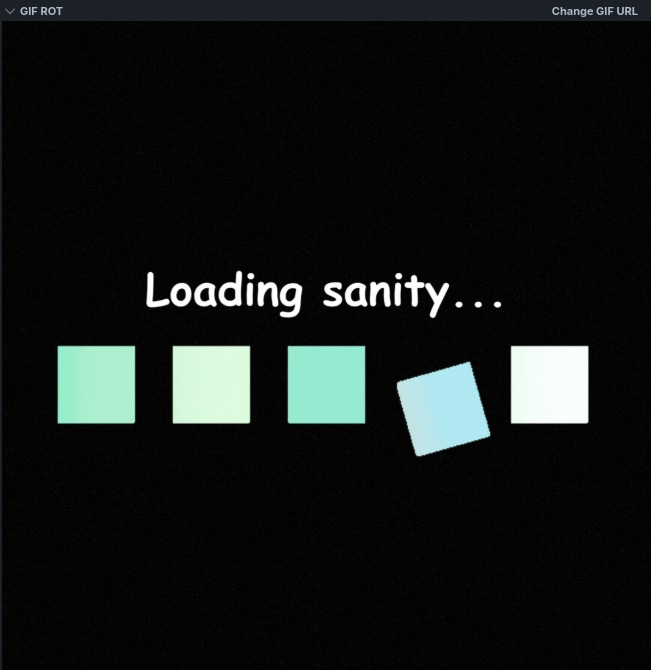

# GifRot README

GifRot is a simple Visual Studio Code extension that displays a GIF inside a dedicated sidebar view.
Users can change the GIF by providing any direct GIF URL (ending with **`.gif`**) through the extension's view actions.

## Features

- Sidebar panel for displaying GIFs
- Button in the view title area to set a new GIF URL
- Supports any direct GIF link
- Remembers the last selected GIF between sessions

## Extension Settings

GifRot stores the GIF URL using VS Code’s global state.

## Release Notes

### 0.0.1

- Initial release
- Sidebar view with GIF rendering
- URL input action added

---

**Enjoy!**
